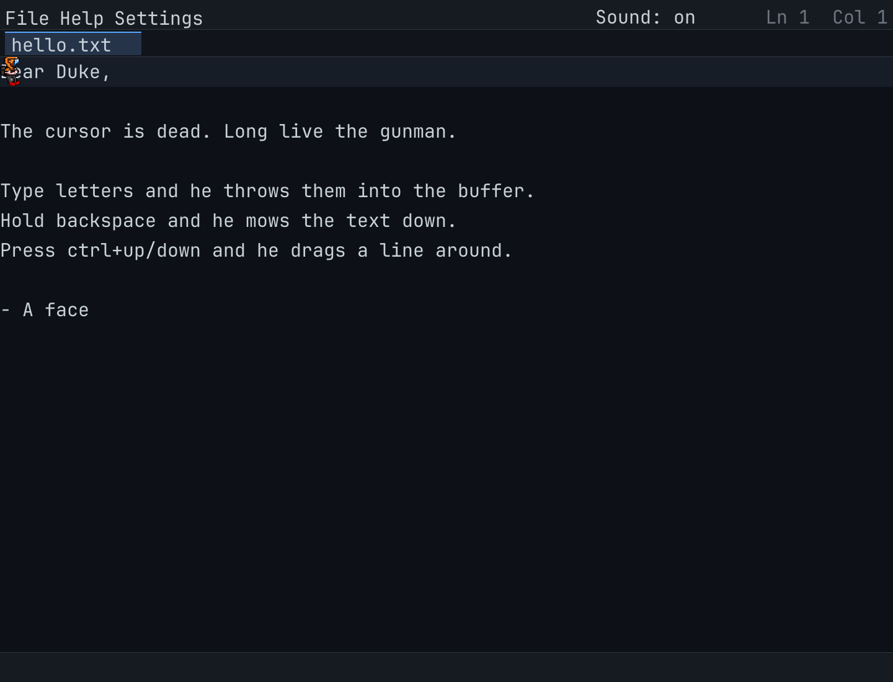

# DUKE — the gunman text editor

A notepad with **no cursor**. A Duke Nukem-style gunman lives inside the
text buffer: he walks to wherever you point him, throws letters into the
place when you type, **shoots glyphs out** when you delete, drags lines
around when you reorder them, and celebrates when the file is saved.



> **Support Xyzzy if you want this to be maintained!**
> https://xyzzy.gumroad.com/l/ykqqqy

Built with Go and [Ebitengine](https://ebitengine.org) using an embedded
bitmap font and fully procedural pixel-art sprites.

## Controls

| Input | Weapon / what happens |
|---|---|
| type | he throws letters that stamp into the buffer |
| `Backspace` (hold = auto-fires) | **giant katana swing** on the glyph behind (pistol when 5+ cells away) |
| `Delete` / **right-click a glyph** | same rule: katana up close, pistol at range, fired from where he stands |
| **`Ctrl+Backspace`** | **SHOTGUN** — blasts the word behind the caret |
| **`Ctrl+Delete`** | shotgun — blasts the word ahead + its trailing spaces |
| **`Ctrl+K`** | **ROCKET LAUNCHER** — emacs kill-line (to end of line, joins at EOL) |
| **`Ctrl+U`** | rocket launcher — shell-style kill back to line start |
| `Ctrl+A` / `Ctrl+E` | emacs: teleport to start / end of line |
| `Enter` / `Tab` | split the line / insert 4 spaces |
| arrows, `Home`, `End`, `PgUp`, `PgDn` | he walks there — he *is* the caret |
| left-click | walk there |
| `Ctrl+Up` / `Ctrl+Down` | grabs the current line with his hands and drags it past its neighbour |
| `Ctrl+Z` / `Ctrl+Shift+Z` / `Ctrl+Y` | undo / redo (offline only in multiplayer) |
| `Ctrl+S` / File > Save | **saves the active tab to a file** — untitled buffers open the native save dialog, named ones save in place |
| `Ctrl+O` | reload from disk |
| **`Ctrl+T` / `Ctrl+W`** | open / close a tab (click tabs in the strip) |
| **`F2`** | chat line (Enter sends, Esc cancels) |
| `F1` / `Esc` | help dialog |

**Menus**: the `File` menu (New / Save / Close) and `Help` menu (Help
Topics / **About**) live in the top bar. **Help > About** shows the
support link — clicking it opens your browser.

## Tabs

The strip under the menu bar holds multiple buffers. Each tab remembers
its own file, caret position and undo history; `Ctrl+T` opens a scratch
tab (`untitled-N`), `Ctrl+W` closes one, clicking switches. In a LAN
session the shared session owns tab 1 — extra tabs stay local.

## Build and run

Prerequisites: Go 1.22+ (developed on 1.26), Windows/macOS/Linux — no C
compiler needed. [Task](https://taskfile.dev) is optional.

```sh
task build              # gofmt + vet + tests + bin/duke.exe
task run                # build and run
task run -- notes.txt   # open a file (default: untitled.txt)

# without Task:
go test ./...
go run ./cmd/duke notes.txt
```

A missing file starts a new buffer; `Ctrl+S` (or **File > Save**) writes
it.

### Cross-compiling

`task dist` (or `task dist-linux`, `task dist-darwin`,
`task dist-darwin-arm64`) produces pure-Go (`CGO_ENABLED=0`) binaries:

```
bin/duke.exe            windows/amd64
bin/duke-linux-amd64    linux/amd64
bin/duke-darwin-amd64   macOS intel
bin/duke-darwin-arm64   macOS Apple Silicon
```

Ebitengine loads its native libraries dynamically at runtime, so no C
toolchain is needed for cross-builds.

## Sound

Sound effects are **sample based**: WAV files named `slash.wav`,
`pistol.wav`, `shotgun.wav`, `rocket.wav`, `stamp.wav` and `save.wav`
in a `sounds/` directory.

The shipped samples come from **[Destroy Any Website](https://destroy.spritefusion.com/)**
by [Sprite Fusion](https://www.spritefusion.com/pixel-art-generator)
(pistol / shotgun / rocket / starSweep-as-katana / hitPaper / complete),
extracted from their `chip.flac` atlas:

```sh
./scripts/fetch-sfx.ps1        # re-download and re-extract the six cues
go run ./cmd/gensounds         # OR regenerate the synthesized set
```

Drop in your own recordings with those file names and they play
immediately — no code changes. Missing files mean silence (no audio
device is even opened). The experimental built-in synthesizer stays
available behind the `-synth` flag for future tinkering.

## Multiplayer (LAN)

```sh
# terminal 1 - host (your buffer is authoritative)
bin/duke.exe -serve :3310 notes.txt

# terminal 2 - a human friend
bin/duke.exe -join 127.0.0.1:3310 -name SCARFACE

# terminal 3 - the scripted test bot (walks, shoots, trash-talks)
bin/duke.exe -join 127.0.0.1:3310 -bot
```

Everyone sees each other's gunmen with name tags and **cartoon chat
bubbles** above their heads. Press **F2** to type a line (Enter sends,
Esc cancels). Buffer edits sync through the host (last-writer-wins on
conflicts; undo/redo is offline-only while connected). The bot says
things like *"got'em"*, *"too slow"* and *"hail to the king, baby"*
while randomly destroying text.

## Add your own sprites

All character art is **plain text** living in
`internal/render/sprites.go` — no image files, no tools, just edit and
re-run. Each frame is 12 rows wide by 16 tall (the game draws it at 2x,
so 24x32 on screen), written as one string per row:

```go
frameIdle: full(torsoRows, baseLegs),
// rows: 1 empty (breathing margin), 7 head, 4 torso, 4 legs
"..kbbk.kbbk.",   // each char = one pixel, '.' = transparent
```

Characters index the `palette` map:

| char | means | char | means |
|---|---|---|---|
| `.` | transparent | `k` | outline |
| `h` | hair | `g`/`G` | lens / glint |
| `s`/`S` | skin / shade | `r`/`R` | shirt / shade |
| `b` | jeans | `n` | gold buckle |
| `p`/`t` | boots / steel toe | `w`/`d` | gun light / dark |
| `o` | shotgun wood | | |

Rules: every row must be exactly 12 chars, every frame exactly 16 rows,
and row 0 stays empty (the breathing bob lives there). `task check`
validates dimensions and palette characters automatically, so mistakes
fail the build instead of the game. Frames needed: `idle`, `walk0`-`walk3`,
`aim`, `shotgun`, `rocket`, `katana`, `win` — see `pose()` for how states
map to frames.

## Development

```sh
task check   # gofmt -l, go vet, go test
task fmt     # format sources
task dist    # native build + cross-compiled release binaries
```

Layout:

```
cmd/duke         Ebitengine game loop, input polling, LAN wiring
cmd/gensounds    offline WAV sample generator
internal/doc     line buffer + undo/redo (pure data model)
internal/events  input event types + synchronous pub/sub bus
internal/agent   the gunman: movement + animation state machine
internal/actions command queue, projectiles, weapons, caret
internal/grid    cell <-> world-pixel mapping (shared)
internal/render  camera/layout, ASCII-art sprites, particles, HUD, tabs
internal/fileio  Store interface + OS file implementation
internal/ui      key mapping, menus, dialogs, tabs, chat (mock-tested)
internal/netplay LAN protocol, host/client, shared-buffer sync
internal/bot     deterministic trash-talking test bot
internal/audio   sample playback (+ optional -synth engine)
```

Design details, invariants and the full requirement spec live in
[SPEC.md](SPEC.md). The session task list is in [TODO.md](TODO.md).

### Debug: frame dumps

```sh
go run ./cmd/duke -dump shot.png notes.txt
```
renders 90 frames, saves the screenshot to `shot.png` and exits — useful
for checking the renderer without interacting.

## License

PolyForm Noncommercial License 1.0.0 — see [LICENSE](LICENSE).
Free for personal/noncommercial use (the license text carries the
required copyright notice from this repo's git config).
